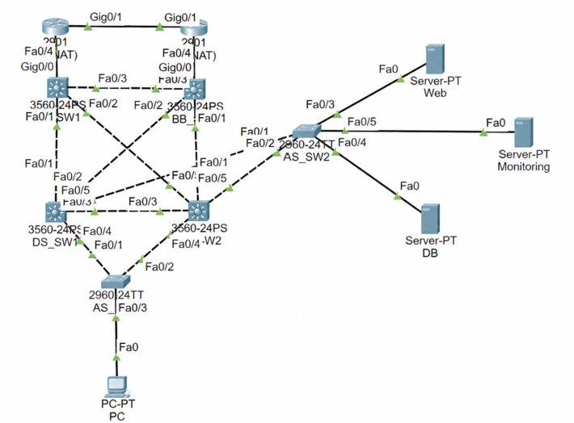

# TrustNet - Hybrid Cloud DR & Network Monitoring

온프레미스 네트워크와 AWS를 연결하여 서비스 장애 발생 시 자동으로 AWS DR 환경으로 전환하는 하이브리드 클라우드 인프라 프로젝트입니다.

---

## Architecture

<p align="center">
  
</p>

- **Network** : VLAN 10(User) / VLAN 20(Web) / VLAN 30(DB) / VLAN 56(Monitoring)
- **Redundancy** : HSRP · Static Routing · ECMP · Rapid-PVST
- **Security** : VLAN 기반 망 분리 및 ACL 접근 제어
- **Hybrid Cloud** : WireGuard VPN을 통한 On-Premise ↔ AWS 연결
- **DR** : 서비스 장애 감지 시 DNS를 AWS Wiki.js로 자동 전환
- **Monitoring** : ICMP · HTTP · TCP 기반 네트워크 및 서비스 상태 확인

---

## Network Topology

<p align="center">
  
</p>

- Backbone / Distribution / Access 계층으로 네트워크 구성
- VLAN 10(User), VLAN 20(Web), VLAN 30(DB), VLAN 56(Monitoring)으로 네트워크 분리
- HSRP와 Rapid-PVST를 이용한 게이트웨이 및 L2 경로 이중화
- Floating Static Route와 ECMP를 이용한 네트워크 경로 이중화
- ACL을 통한 사용자망 → DB 서버 직접 접근 제한

---

## Network Configuration

### HSRP

- VLAN 10 : DS_SW1 Active
- VLAN 20/30 : DS_SW2 Active
- Virtual Gateway : 각 VLAN `.254`
- Active 장비 장애 시 Standby 장비로 게이트웨이 전환

### Routing / ECMP

- 실제 장비 환경은 Static Routing 기반으로 구성
- Floating Static Route와 ECMP를 적용하여 경로 이중화
- 네트워크 경로 장애 발생 시 대체 경로를 통한 통신 확인

### Rapid-PVST

- VLAN 10 : DS_SW1 Root
- VLAN 20/30 : DS_SW2 Root
- HSRP Active 장비와 VLAN별 Root Bridge를 일치하도록 구성
- 이중화 링크에서 발생할 수 있는 L2 Loop 방지

### VLAN / Trunk

- VLAN 10 : User Network
- VLAN 20 : Web Network
- VLAN 30 : DB Network
- VLAN 56 : Monitoring Network
- 장비 간 연결 구간은 Trunk로 구성
- 사용자 및 서버 연결 포트는 용도에 따라 Access Port로 구성

### ACL

- 사용자망(VLAN 10) → DB 서버 직접 접근 차단
- 사용자망 → Web 서비스 HTTP/HTTPS 접근 허용
- User / Web / DB 네트워크 간 접근 범위 분리

### OSPF 검증

실제 장비 환경에서는 Static Routing을 적용했으며, OSPF 기반 동적 라우팅 구조는 Packet Tracer에서 별도로 구성하여 경로 학습 및 장애 발생 시 경로 전환을 검증했습니다.

> Packet Tracer에서 구성·검증한 네트워크 장비 설정은 [`network-configs/`](https://github.com/Parkhs88/openstack-hybrid-cloud/tree/main/network-configs)에서 확인할 수 있습니다.
---

## Monitoring & DR

### 장애 감지

모니터링 VM에서 네트워크 장비와 서비스 상태를 주기적으로 확인합니다.

```text
check_onprem_status.sh
 ├─ DS_SW1 / DS_SW2 → ICMP
 ├─ Wiki.js         → HTTP
 └─ PostgreSQL      → TCP
          ↓
       장애 판단
```

Prometheus와 Blackbox Exporter를 통해 별도로 상태 정보를 수집합니다.

```text
Prometheus
 └─ Blackbox Exporter
      ├─ Network Device → ICMP
      ├─ Wiki.js        → HTTP
      └─ PostgreSQL     → TCP
```

### DR 자동 전환

```text
[정상 상태]

User
 ↓
On-Premise Wiki.js
 ↓
PostgreSQL


[장애 발생]

Monitoring VM
 ↓
장애 감지
 ↓
change_dns_to_aws.sh
 ↓
DNS Failover
 ↓
AWS Wiki.js


[서비스 복구]

On-Premise 정상화
 ↓
복구 감지
 ↓
change_dns_to_onprem.sh
 ↓
DNS 원복
 ↓
On-Premise Wiki.js
```

### Dashboard

Node.js API를 통해 장애 로그와 현재 DNS 상태를 제공하고 React Dashboard에서 Prometheus 및 API 데이터를 조회하여 네트워크·서비스 상태를 시각화합니다.

```text
Node.js API
 ├─ GET /logs → 장애 및 복구 로그
 └─ GET /dns  → 현재 DNS 상태

React Dashboard
 ├─ Prometheus API
 ├─ Node.js API
 └─ 네트워크 및 서비스 상태 시각화
```

---

## 구현 및 검증 결과

<p align="center">
  
</p>

- 네트워크 장비 ICMP 상태 모니터링
- Wiki.js HTTP / PostgreSQL TCP 상태 모니터링
- 장애 및 복구 이벤트 로그 확인
- On-Premise / AWS DNS 전환 상태 확인
- 장애 발생 시 AWS DR 환경으로 자동 전환
- 온프레미스 서비스 복구 후 기존 환경으로 자동 원복
- WireGuard를 통한 On-Premise ↔ AWS 통신 확인
- 네트워크 경로 및 게이트웨이 장애 상황에서 이중화 동작 확인

---

## 한계점 및 개선 방향

- AWS에 모니터링 서버를 구축하려 했으나 연동 문제로 VLAN56에 구성
- 온프레미스 전체 장애 시 모니터링 서버도 함께 영향을 받을 수 있음
- 추후 모니터링 서버를 AWS로 분리하여 외부에서 장애를 감지하도록 개선
  
---

## Network Equipment

| 장비 | 모델 | 역할 |
|---|---|---|
| BB_SW1 | Cisco Catalyst 3065X | Backbone L3 Switch |
| BB_SW2 | Cisco Catalyst 3065X | Backbone L3 Switch |
| DS_SW1 | Cisco Catalyst 3065 | Distribution L3 Switch |
| DS_SW2 | Cisco Catalyst 3065G | Distribution L3 Switch |
| AS_SW | Cisco Catalyst 2950 | Access L2 Switch |

---

## Environment

| 항목 | 값 |
|---|---|
| Monitoring VM | 192.168.56.10 (VLAN56) |
| Wiki.js | 192.168.20.20 (VLAN20) |
| PostgreSQL | 192.168.30.30 (VLAN30) |
| DS_SW1 | 192.168.60.1 |
| DS_SW2 | 192.168.60.2 |
| AWS Wiki.js | 172.31.32.43 |
| WireGuard On-Premise | 10.200.0.1 |
| WireGuard AWS | 10.200.0.2 |
| Internal Domain | service.local |

---

## Repository Structure

```text
openstack-hybrid-cloud/
│
├── config/                  # DNS 및 DR 전환 설정
├── docs/
│   ├── images/              # Architecture / Topology / Dashboard
│   └── documents/           # 프로젝트 구현 과정 문서
│
├── log-api/                 # 장애 로그 및 DNS 상태 API
├── monitoring/              # Prometheus / Blackbox Exporter
├── network-configs/         # Packet Tracer 네트워크 설정
├── react-ui/                # 모니터링 웹 대시보드
├── scripts/                 # 장애 감지 및 DR 자동 전환
├── services/                # On-Premise / AWS 서비스 구성
├── wireguard/               # On-Premise ↔ AWS VPN 구성
└── README.md
```
