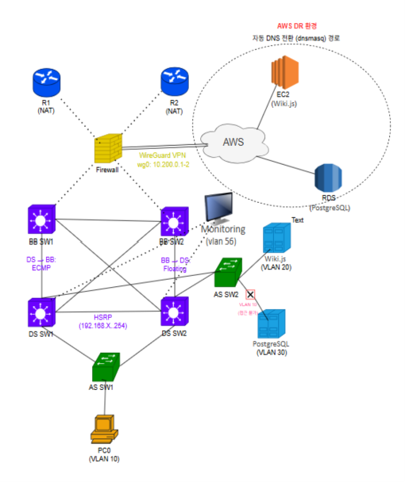
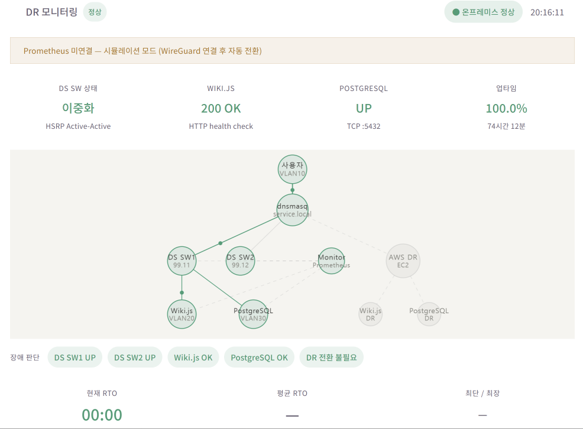

# TrustNet - Hybrid Cloud DR & Network Monitoring

온프레미스 네트워크와 AWS를 연결하여 서비스 장애 발생 시 자동으로 AWS DR 환경으로 전환하는 하이브리드 클라우드 인프라 프로젝트입니다.

---

## Architecture

<p align="center">
  
</p>

- **Network** : VLAN 10(User) / VLAN 20(Web) / VLAN 30(DB) / VLAN 56(Monitoring)
- **Redundancy** : HSRP · OSPF/ECMP · Rapid-PVST
- **Hybrid Cloud** : WireGuard VPN을 통한 On-Premise ↔ AWS 연결
- **DR** : 서비스 장애 감지 시 DNS를 AWS Wiki.js로 자동 전환
- **Monitoring** : ICMP · HTTP · TCP 기반 네트워크 및 서비스 상태 확인

---

## Network Equipment

프로젝트에서는 Cisco Catalyst L3/L2 스위치를 이용해 실제 네트워크 환경을 구성했습니다.

| 장비 | 모델 | 역할 |
|---|---|---|
| BB_SW1 | Cisco Catalyst 3065X | Backbone L3 Switch |
| BB_SW2 | Cisco Catalyst 3065X | Backbone L3 Switch |
| DS_SW1 | Cisco Catalyst 3065 | Distribution L3 Switch |
| DS_SW2 | Cisco Catalyst 3065G | Distribution L3 Switch |
| AS_SW | Cisco Catalyst 2950 | Access L2 Switch |

---

## 파일 구조 및 실제 배포 경로

```text id="2yodte"
openstack-hybrid-cloud/
│
├── config/                            → 서비스 동작에 필요한 설정 파일
│   └── dnsmasq/
│       └── internal.conf              → 내부 DNS 및 DR 전환 설정
│
├── docs/                              → 프로젝트 아키텍처 및 결과 자료
│   ├── architecture.png               → 전체 시스템 아키텍처
│   ├── dashboard.png                  → 모니터링 대시보드 결과
│   └── images/                        → README 및 프로젝트 설명 이미지
│
├── log-api/                           → 장애 로그 및 DNS 상태 조회 API
│   └── server.js
│
├── monitoring/                        → 네트워크·서비스 상태 모니터링 구성
│   ├── docker-compose.yml             → Prometheus / Blackbox Exporter 실행
│   └── prometheus.yml                 → 모니터링 대상 및 수집 설정
│
├── network-configs/                   → 네트워크 장비별 설정 파일
│   ├── README.md
│   ├── backbone/                      → Backbone Switch 설정
│   │   ├── BB_SW1.cfg
│   │   └── BB_SW2.cfg
│   ├── distribution/                  → Distribution Switch 설정
│   │   ├── DS_SW1.cfg
│   │   └── DS_SW2.cfg
│   └── access/                        → Access Switch 설정
│       ├── AS_SW1.cfg
│       └── AS_SW2.cfg
│
├── react-ui/                          → 네트워크·서비스 모니터링 웹 대시보드
│   ├── index.html
│   ├── vite.config.js
│   ├── package.json
│   └── src/
│       ├── main.jsx
│       ├── App.jsx
│       └── App.css
│
├── scripts/                           → 장애 감지 및 DR 자동 전환 스크립트
│   ├── check_onprem_status.sh         → 온프레미스 서비스 상태 확인
│   ├── change_dns_to_aws.sh           → 장애 발생 시 AWS로 DNS 전환
│   └── change_dns_to_onprem.sh        → 복구 후 온프레미스로 DNS 원복
│
├── services/                          → On-Premise / AWS 서비스 구축 스크립트
│   ├── onprem/
│   │   ├── wikijs/
│   │   │   └── setup.sh              → 온프레미스 Wiki.js 환경 구성
│   │   └── postgresql/
│   │       └── setup.sh              → 온프레미스 PostgreSQL 환경 구성
│   └── aws/
│       ├── wikijs/
│       │   └── setup.sh              → AWS Wiki.js 환경 및 RDS 연결 구성
│       └── rds/
│           └── setup.sh              → AWS RDS PostgreSQL 구성
│
├── wireguard/                         → On-Premise ↔ AWS VPN 구성
│   ├── onprem/
│   │   └── setup.sh                  → 온프레미스 WireGuard 설정
│   └── aws/
│       └── setup.sh                  → AWS EC2 WireGuard 설정
│
└── README.md                          → 프로젝트 전체 설명
---

## Network Configuration

### HSRP

- VLAN 10 : DS_SW1 Active
- VLAN 20/30 : DS_SW2 Active
- Virtual Gateway : 각 VLAN `.254`
- 게이트웨이 이중화를 통해 Active 장비 장애 시 Standby 장비로 전환

### OSPF / ECMP

*실제 장비에서는 OSPF 미지원으로 Static Routing을 사용하고, Floating Static Route와 ECMP를 적용하여 경로를 이중화했습니다.*

- Backbone–Distribution 구간 OSPF 기반 동적 라우팅 구성
- 동일 Cost 경로를 이용한 ECMP 구성
- VLAN 네트워크를 OSPF에 광고하고 VLAN 인터페이스는 Passive Interface로 설정
- 네트워크 경로 장애 발생 시 OSPF 재계산을 통한 우회 경로 전환 확인

### Rapid-PVST

- Rapid-PVST 기반 L2 이중화 구성
- VLAN 10 : DS_SW1 Root
- VLAN 20/30 : DS_SW2 Root
- HSRP Active 장비와 VLAN별 Root Bridge를 일치하도록 구성
- 이중화 링크에서 발생할 수 있는 L2 Loop 방지

### VLAN / Trunk

- VLAN 10 : User Network
- VLAN 20 : Web Network
- VLAN 30 : DB Network
- VLAN 56 : Monitoring Network
- Trunk 구간을 통해 장비 간 필요한 VLAN 트래픽 전달
- 사용자 및 서버 연결 포트는 용도에 따라 Access Port로 구성

### ACL

- 사용자망(VLAN 10)에서 DB 서버로의 직접 접근 차단
- 사용자망에서 Web 서비스 HTTP/HTTPS 접근 허용
- 사용자 / Web / DB 네트워크 간 접근 범위 분리

### Device Configuration

네트워크 장비의 세부 설정은 [`network-configs/`](https://github.com/Parkhs88/openstack-hybrid-cloud/tree/main/network-configs)에서 확인할 수 있습니다.
> `.cfg` 파일은 OSPF 기반 네트워크 구성을 Packet Tracer에서 구현하고 검증한 설정입니다. 실제 장비에서는 OSPF를 지원하지 않아 Static Routing 기반으로 구성했습니다.

#### Backbone

- [BB_SW1 Configuration](https://github.com/Parkhs88/openstack-hybrid-cloud/blob/main/network-configs/%20backbone/BB_SW1.cfg)
- [BB_SW2 Configuration](https://github.com/Parkhs88/openstack-hybrid-cloud/blob/main/network-configs/%20backbone/BB_SW2.cfg)

#### Distribution

- [DS_SW1 Configuration](https://github.com/Parkhs88/openstack-hybrid-cloud/blob/main/network-configs/distribution/DS_SW1.cfg)
- [DS_SW2 Configuration](https://github.com/Parkhs88/openstack-hybrid-cloud/blob/main/network-configs/distribution/DS_SW2.cfg)

#### Access

- [AS_SW1 Configuration](https://github.com/Parkhs88/openstack-hybrid-cloud/blob/main/network-configs/access/AS_SW1.cfg)
- [AS_SW2 Configuration](https://github.com/Parkhs88/openstack-hybrid-cloud/blob/main/network-configs/access/AS_SW2.cfg)
---

## 환경 정보

| 항목 | 값 |
|---|---|
| 모니터링 VM | 192.168.56.10 (VLAN56) |
| 서비스 서버 | 192.168.20.20 (VLAN20) |
| DB 서버 | 192.168.30.30 (VLAN30) |
| DS_SW1 | 192.168.60.1 |
| DS_SW2 | 192.168.60.2 |
| AWS Wiki.js | 172.31.32.43 |
| 내부 도메인 | service.local |

---

## 설치 순서 (VLAN56 VM 기준)

### 1. 스크립트 배포

```bash id="doh4ft"
sudo cp scripts/check_onprem_status.sh /usr/local/bin/
sudo cp scripts/change_dns_to_aws.sh /usr/local/bin/
sudo cp scripts/change_dns_to_onprem.sh /usr/local/bin/

sudo chmod +x /usr/local/bin/check_onprem_status.sh
sudo chmod +x /usr/local/bin/change_dns_to_aws.sh
sudo chmod +x /usr/local/bin/change_dns_to_onprem.sh
```

### 2. dnsmasq 설정

```bash id="mv56qs"
sudo apt install -y dnsmasq
sudo cp config/dnsmasq/internal.conf /etc/dnsmasq.d/

# /etc/dnsmasq.conf 에 아래 추가
# server=8.8.8.8

sudo systemctl restart dnsmasq
```

### 3. 로그 파일 권한 설정

```bash id="09emcg"
sudo touch /var/log/dr_check.log
sudo chmod 666 /var/log/dr_check.log
```

### 4. crontab 등록

약 30초 간격으로 온프레미스 상태 확인 스크립트를 실행합니다.

```bash id="r9i01h"
crontab -e

# 아래 두 줄 추가
* * * * * /usr/local/bin/check_onprem_status.sh
* * * * * sleep 30 && /usr/local/bin/check_onprem_status.sh
```

### 5. Prometheus + Blackbox Exporter 실행

```bash id="b4agj1"
mkdir -p ~/monitoring
cp monitoring/docker-compose.yml ~/monitoring/
cp monitoring/prometheus.yml ~/monitoring/

cd ~/monitoring
docker compose up -d
```

### 6. Node.js 로그 API 실행

```bash id="17dqf3"
mkdir -p ~/log-api
cp log-api/server.js ~/log-api/

cd ~/log-api
nohup node server.js &
```

### 7. React 대시보드 실행

```bash id="6phmve"
mkdir -p ~/dr-monitoring
cp -r react-ui/* ~/dr-monitoring/

cd ~/dr-monitoring
npm install
npm run dev
```

---

## 동작 흐름

```text id="vczuj6"
상태 확인 스크립트 (약 30초 간격)
 └→ check_onprem_status.sh
      ├→ DS_SW1 / DS_SW2 ICMP 상태 확인
      ├→ Wiki.js HTTP 상태 확인
      ├→ PostgreSQL TCP 상태 확인
      ├→ 장애 감지 시 change_dns_to_aws.sh 호출
      └→ 복구 감지 시 change_dns_to_onprem.sh 호출


Prometheus (15초 간격)
 └→ Blackbox Exporter
      ├→ Network Device : ICMP
      ├→ Wiki.js        : HTTP
      └→ PostgreSQL     : TCP


Node.js API (Port 3001)
 ├→ GET /logs → 장애 감지 로그 반환
 └→ GET /dns  → 현재 DNS 상태 반환
                (On-Premise / AWS)


React Dashboard (Port 5173)
 ├→ Prometheus API 폴링
 ├→ Node.js API 폴링
 └→ 네트워크 및 서비스 상태 시각화
```

---

## DR 동작

```text id="t7wj0g"
[정상 상태]

User
  ↓
On-Premise Wiki.js
  ↓
PostgreSQL


[장애 감지]

Monitoring VM
  ├→ Network Device ICMP
  ├→ Wiki.js HTTP
  └→ PostgreSQL TCP
          ↓
      장애 판단
          ↓
      DNS Failover
          ↓
      AWS Wiki.js


[복구]

On-Premise 서비스 정상화
          ↓
      복구 감지
          ↓
      DNS 원복
          ↓
On-Premise Wiki.js
```

---

## 구현 결과



- 네트워크 장비 ICMP 상태 모니터링
- Wiki.js HTTP 상태 모니터링
- PostgreSQL TCP 상태 모니터링
- 장애 발생 및 복구 이벤트 로그 확인
- 현재 On-Premise / AWS DNS 전환 상태 확인
- 장애 발생 시 AWS DR 환경으로 서비스 전환
- 온프레미스 복구 확인 후 기존 서비스 환경으로 자동 원복
